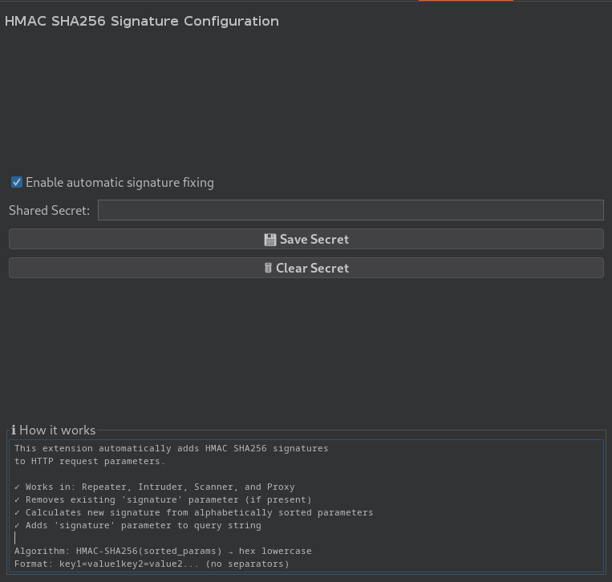

# HMAC Signature Fixer - Burp Suite Extension


A Burp Suite extension that automatically calculates and adds HMAC SHA256 signatures to HTTP requests using the **Shopify App Proxy authentication scheme**.

Perfect for testing Shopify apps, custom APIs, or any system that uses parameter-based HMAC authentication.

## 🎯 What This Extension Does

This extension implements the signature algorithm used by **Shopify App Proxies** and similar systems:

1. Collects all URL and body parameters (excluding `signature`)
2. Sorts them alphabetically by parameter name
3. Concatenates them as `key1=value1,value2key2=value3...` (comma-separated for multiple values)
4. Calculates HMAC-SHA256 using your shared secret
5. Adds the hexadecimal signature as a URL parameter

### Algorithm Details

```
Input parameters:
  extra=1&extra=2&shop=example.myshopify.com&path_prefix=%2Fapps%2Fawesome&timestamp=1317327555

Step 1 - URL-decode values (signature is "unencoded" per Shopify docs):
  path_prefix=%2Fapps%2Fawesome → path_prefix=/apps/awesome

Step 2 - Sort alphabetically and concatenate:
  extra=1,2path_prefix=/apps/awesomeshop=example.myshopify.comtimestamp=1317327555

Step 3 - Calculate HMAC-SHA256:
  4c68c8624d737112c91818c11017d24d334b524cb5c2b8ba08daa056f7395ddb

Final request:
  ?extra=1&extra=2&shop=example.myshopify.com&path_prefix=%2Fapps%2Fawesome&timestamp=1317327555&signature=4c68c8...
```

This follows the [Shopify App Proxy authentication specification](https://shopify.dev/docs/apps/build/online-store/app-proxies/authenticate-app-proxies).

## 🚀 Features

- ✅ **Automatic signature generation** - Signs every request in Repeater, Intruder, Scanner, and Proxy
- ✅ **Real-time updates** - Modify parameters and signatures are recalculated automatically
- ✅ **Shopify-compliant** - Follows the exact algorithm used by Shopify App Proxies
- ✅ **Easy configuration** - Simple UI to set your shared secret
- ✅ **Debug logging** - See exactly what's being signed in the extension output
- ✅ **Toggle on/off** - Enable or disable signing without reloading the extension

## 📸 Screenshots



## 🔧 Installation

### Option 1: Build from source

```bash
# Clone the repository
git clone https://github.com/moorada/Shopify-HMAC-Signature-Fixer.git
cd Shopify-HMAC-Signature-Fixer

# Build the extension
./gradlew jar

# The JAR will be in build/libs/
```

### Option 2: Download prebuilt JAR

Download the latest release from the [Releases](https://github.com/moorada/Shopify-HMAC-Signature-Fixer/releases) page.

### Load in Burp Suite

1. Open Burp Suite
2. Go to **Extensions** → **Installed** → **Add**
3. Select the JAR file from `build/libs/`
4. The extension will load automatically

## 📖 Usage

### Quick Start

1. After loading, go to the **HMAC Fixer** tab in Burp Suite
2. Enter your shared secret in the text field (from your Shopify app settings)
3. Click **💾 Save Secret**
4. Make sure "Enable automatic signature fixing" is checked
5. All requests will now be automatically signed!

## 🛠️ Development

### Requirements

- Java 21+
- Gradle 8+
- Burp Suite Professional or Community Edition

### Build Commands

```bash
./gradlew build    # Build and test
./gradlew jar      # Create JAR file
./gradlew clean    # Clean build artifacts
```
